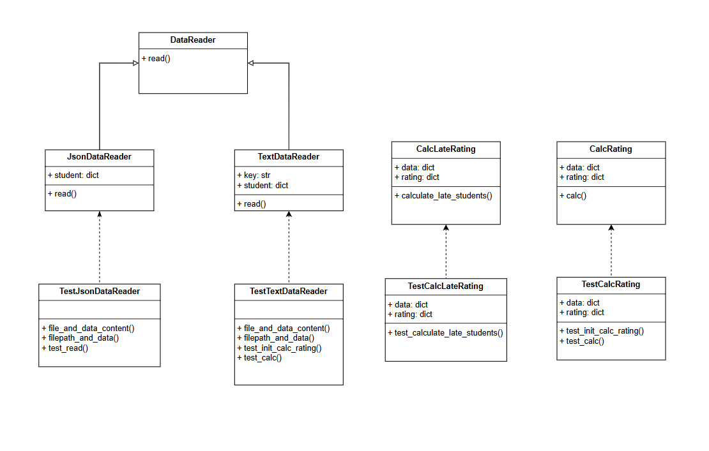

# Лабораторная работа № 1 "Знакомство с системой контроля версий Git и инструментом CI/CD GitHub Actions"

## Цели работы:

1. Познакомиться c распределенной системой контроля версий кода Git и ее функциями;
2. Познакомиться с понятиями «непрерывная интеграция» (CI) и «непрерывное развертывание»
   (CD), определить их место в современной разработке программного обеспечения;
3. Получить навыки разработки ООП-программ и написания модульных тестов к ним на
   современных языках программирования;
4. Получить навыки работы с системой Git для хранения и управления версиями ПО;
5. Получить навыки управления автоматизированным тестированием программного обеспечения,
   расположенного в системе Git, с помощью инструмента GitHub Actions.

## Краткое описание проекта

Проект представляет собой консольное приложение, написанное на языке Python. Программа рассчитывает и выводит на экран количество студентов, имеющих академические задолженности (имеющих балл < 61 хотя бы по одному предмету).

## Используемые языки/библиотеки/технологии

- Язык программирования: Python 3.10
- Библиотеки: `json` для работы с файлами JSON, `argparse` для разбора аргументов командной строки, `pytest` для тестирования, `pycodestyle` для проверки стиля кода
- Технологии: объектно-ориентированное программирование, абстрактные классы

## UML-диаграмма

## Выводы

В ходе лабораторной работы была разработана программа для расчета рейтинга студентов на основе их оценок по различным предметам. Программа поддерживает чтение данных из JSON и текстовых файлов. Для обеспечения модульности и расширяемости использовалось объектно-ориентированное программирование и абстрактные классы.

Программа состоит из нескольких классов:

- `CalcRating`: класс для вычисления рейтинга ученика
- `DataReader`: абстрактный класс для чтения данных из файлов
- `JsonDataReader`: класс для чтения данных из JSON-файлов
- `TextDataReader`: класс для чтения данных из текстовых файлов

Программа работает следующим образом:

1.  Пользователь запускает программу и передает путь к файлу данных в качестве аргумента командной строки.
2.  Программа считывает данные из файла и создает объект класса `CalcRating`.
3.  Объект `CalcRating` вычисляет рейтинги студентов и определяет студентов с академической задолженностью.
4.  Программа выводит результаты расчетов на экран.

В ходе выполнения лабораторной работы использовались следующие технологии:

- язык программирования Python 3.10
- библиотеки `json`, `argparse`, `pytest`, `pycodestyle`
- объектно-ориентированное программирование и абстрактные классы.

Программа работает корректно и рассчитывает рейтинги студентов на основе их оценок
